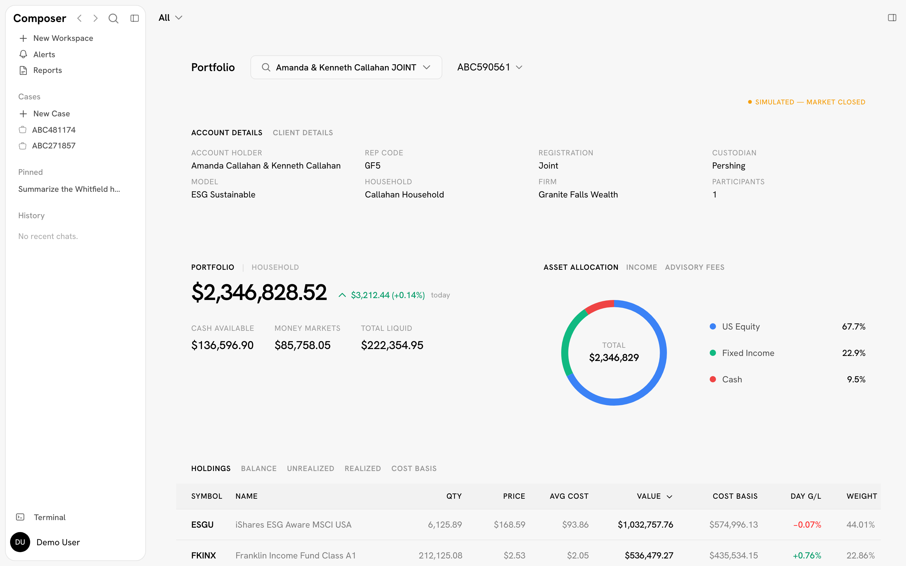
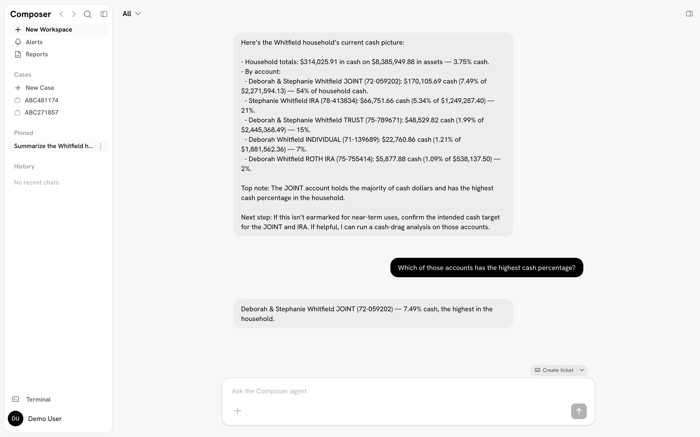
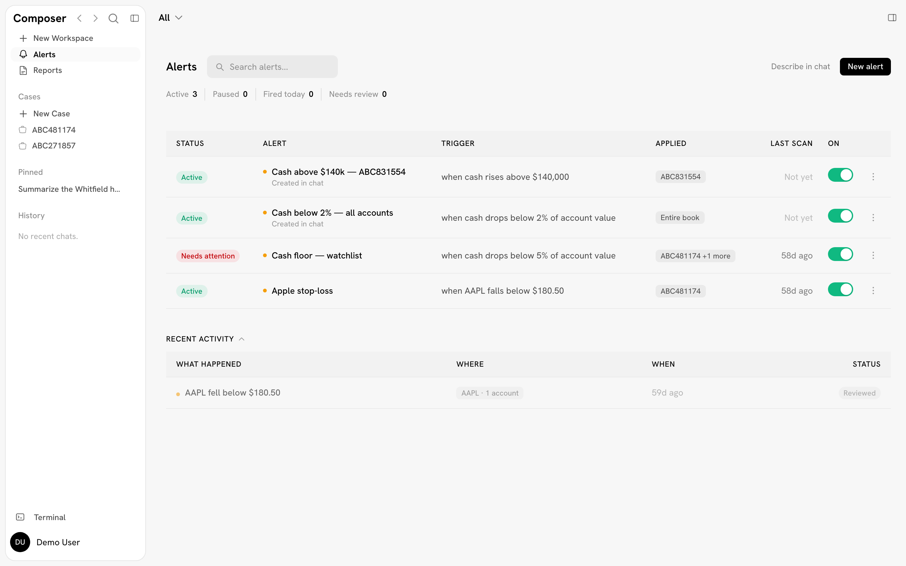
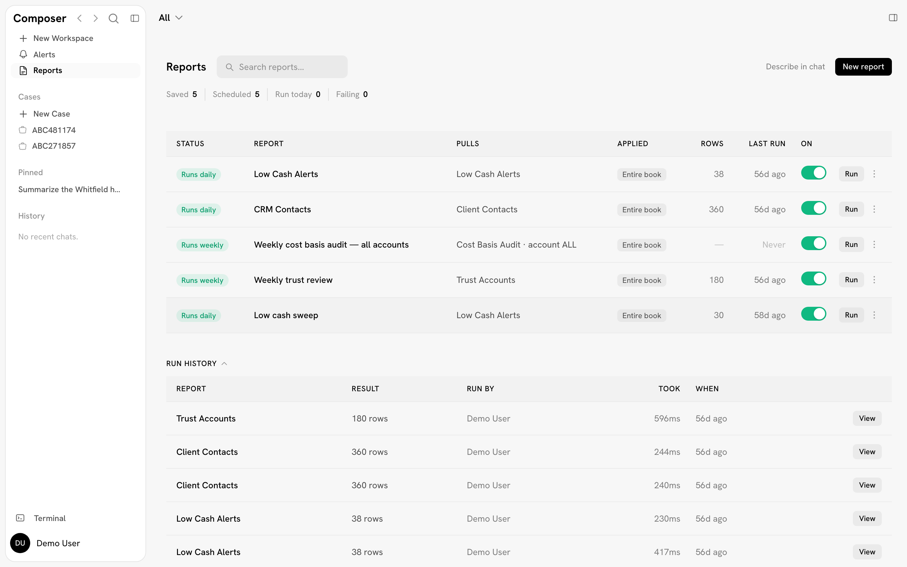
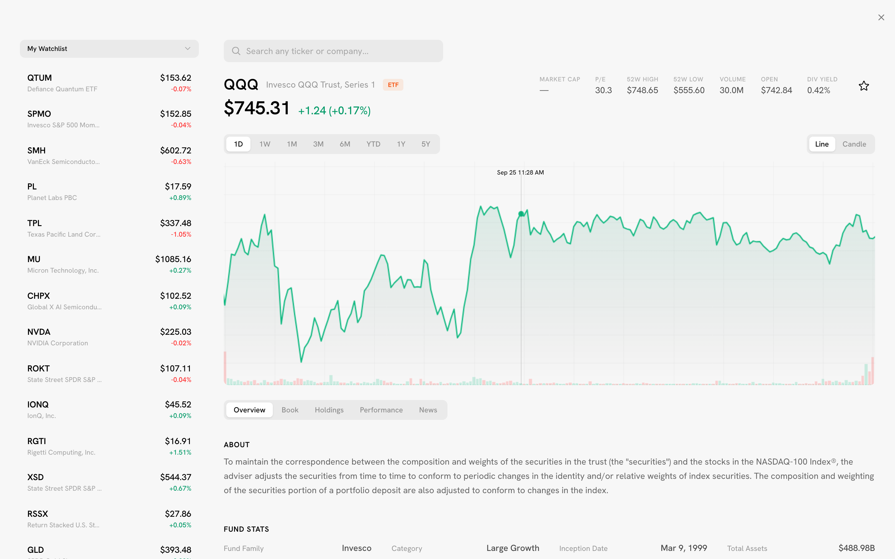
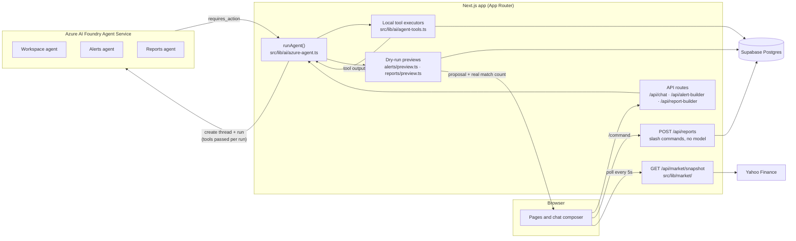

<div align="center">


# Composer

**An AI-assisted workspace for wealth-management advisors.**


</div>



## Overview

Composer puts a financial advisor's book of business in one place: client households, accounts and holdings, CRM records, alerts, recurring reports, and case work. On top of that data sits an AI assistant that can answer questions about the book ("which of the Whitfield accounts is holding the most cash?"), and can set up alerts and reports from a plain-English request. Every alert or report the AI proposes is first run against the real data, so the advisor sees what it would actually catch before saving it. The app opens straight into a demo advisor's workspace with no login, and all client data is synthetic.

## Highlights

- **Three task-specific AI agents.** Azure AI Foundry agents for the workspace, alerts and reports, each with its own instructions, all run through one function (`runAgent` in `src/lib/ai/azure-agent.ts`).
- **Tools run inside the app, not in the cloud.** When an agent needs data, the run pauses, Composer executes the tool locally against the database and sends back the result. Azure never calls into the app.
- **Proposals are checked against live data.** Before an AI-drafted alert or report is shown for confirmation, the server runs it as a dry run and puts the real match count and sample rows on the card (`src/lib/alerts/preview.ts`, `src/lib/reports/preview.ts`).
- **Slash commands skip the model.** Catalog report commands execute their registered query directly through `POST /api/reports`: instant, deterministic, and free of AI cost.
- **One market snapshot for every page.** All account screens poll a single endpoint (`GET /api/market/snapshot`, every 5 seconds) and take totals from it, so one account can't show two different values on two pages. When the market is closed, prices are simulated deterministically and clearly labelled "Simulated".
- **Agent definitions live in the repo.** Agent names, instructions and tool schemas are versioned in code and pushed to Foundry with `npm run agents:sync`, so the portal can't drift from what the code can execute.
- **Collaborative cases.** A case is a shared, realtime thread (Supabase Realtime) for one account, with document uploads and `@agent` mentions that bring the AI into the conversation.

## Screenshots

<table>
  <tr>
    <td width="50%"></td>
    <td width="50%"></td>
  </tr>
  <tr>
    <td><b>Workspace chat.</b> The Workspace agent answers from live account data it fetches through tools; conversations persist and can be pinned.</td>
    <td><b>Alert Center.</b> Rules (cash thresholds, price stops, and more) with status, scope and last scan, plus a triage feed of what fired.</td>
  </tr>
  <tr>
    <td width="50%"></td>
    <td width="50%"></td>
  </tr>
  <tr>
    <td><b>Report Center.</b> Saved and scheduled reports with run history. New reports can be described in chat to the Reports agent.</td>
    <td><b>Terminal.</b> Market research: watchlists, price charts, fundamentals and news for any ticker.</td>
  </tr>
</table>

## Features

| Area | What it does | Where |
|---|---|---|
| Accounts | Portfolio detail, firm-wide holdings, households, cash, billing, performance, retirement contributions, trading blotter, transfers | `src/app/accounts/` |
| Share-class analysis | Flags holdings that have a cheaper share class of the same fund, using fund data from SEC prospectus filings | `src/app/accounts/share-class/`, `src/lib/share-class/` |
| CRM | Searchable client directory with contact and suitability details | `src/app/communication/crm/` |
| Workspace chat | Chat with the Workspace agent about any account or household; history persists to the database | `src/app/chat/`, `src/app/api/chat/` |
| Alerts | Rule builder (by hand or by chat), a scheduled evaluator, and a triage feed | `src/app/alerts/`, `src/lib/alerts/` |
| Reports | A catalog of report queries, saved and scheduled reports, run history, Excel export | `src/app/reports/`, `src/lib/reports/`, `src/lib/report-registry.ts` |
| Cases | Realtime shared threads per account, with documents and `@agent` mentions | `src/app/cases/`, `src/app/api/cases/` |
| Terminal | Quotes, charts and fundamentals from Yahoo Finance | `src/app/knowledge/terminal/` |
| Exports | Holdings and transactions to Excel; portfolio report to PDF | `src/lib/*-export.ts`, `src/components/portfolio/PortfolioReportPDF.tsx` |

## AI architecture



**How a turn works.** The API route calls `runAgent` with an agent key (`workspace`, `alerts` or `reports`). It creates a Foundry thread, starts a run with the tool schemas from `agent-tools.ts`, and polls. When the run reaches `requires_action`, Composer executes the requested tools itself (account lookups, holdings search, report queries) and submits the outputs back. Azure never needs a route into the app, so no tunnel or inbound credentials are involved. Threads are created and deleted per request, and the database stays the single record of the conversation.

**Proposals are verified, not trusted.** The Alerts and Reports agents answer with a structured proposal through a tool call. Before the confirm card is shown, the server evaluates that proposal against live data using the same scope resolution and query code as the real evaluator, with a time budget, and with no writes. The number on the card is the evaluator's own count, not the model's estimate. If the preview can't finish, the proposal is still shown without it.

**Deterministic where it can be.** Catalog slash commands run their registry query directly. Market prices when the exchange is closed come from a pure function of symbol, anchor price, volatility and a 5-second time bucket, so two tabs, two pages and a server restart all agree.

**Authentication to Azure** uses Microsoft Entra only (`DefaultAzureCredential`): `az login` locally or a managed identity when hosted. No AI API key is stored.

## Tech stack

| Layer | Choice |
|---|---|
| Framework | Next.js 16 (App Router, standalone output), React 19, TypeScript (strict) |
| Styling | Tailwind CSS 4, five themes (light, dark, medium, glass, mocha) |
| Data | Supabase Postgres via `@supabase/supabase-js`; Supabase Realtime for cases and alerts |
| Schema and seed | Prisma 7 (schema and seed script only; not used at runtime) |
| AI | Azure AI Foundry Agent Service (`gpt-5`), `@azure/identity` |
| Market data | `yahoo-finance2`, SEC EDGAR, `lightweight-charts` |
| Export | ExcelJS, `@react-pdf/renderer` |
| Testing | Playwright |
| Deployment | Dockerfile for Azure App Service / Container Apps; scheduled jobs are plain HTTP routes guarded by `CRON_SECRET` |

## Repository layout

| Path | Contents |
|---|---|
| `src/app/` | Pages (`accounts/`, `alerts/`, `reports/`, `chat/`, `cases/`, `communication/`, `knowledge/`) and API routes (`api/`) |
| `src/components/` | UI by domain (`ai-chat/`, `alerts/`, `portfolio/`, `terminal/`, ...) plus shared `ui/` primitives |
| `src/lib/ai/` | Foundry client and runner, agent definitions, agent instructions (`instructions/*.md`), tool schemas, report builder |
| `src/lib/alerts/` | Alert types, validation, evaluator, dry-run preview, alert builder |
| `src/lib/reports/` | Saved-report validation, runner, dry-run preview |
| `src/lib/market/` | Quote cache, market-hours simulator, server-side account totals, rounding |
| `src/lib/auth.ts` | The single auth seam (currently a fixed demo identity) |
| `prisma/` | Database schema and synthetic-data seed script |
| `supabase/migrations/` | Numbered SQL migrations |
| `scripts/` | Foundry agent sync, price updater, market simulator self-test |
| `tests/` | Playwright tests |

## Running locally

**Prerequisites:** Node.js 20+, a Supabase project, and (for the AI features) an Azure AI Foundry project with three agents plus the Azure CLI.

```bash
npm install                  # also generates the Prisma client
cp .env.example .env.local   # then fill in the values below
npm run dev                  # http://localhost:3000
```

Required variables (placeholders in [`.env.example`](.env.example)):

| Variable | Purpose |
|---|---|
| `NEXT_PUBLIC_SUPABASE_URL`, `NEXT_PUBLIC_SUPABASE_ANON_KEY` | Supabase project the app reads and writes |
| `DATABASE_URL` | Postgres connection string, used only by the Prisma seed script |
| `AZURE_AI_PROJECT_ENDPOINT` | Azure AI Foundry project endpoint |
| `AZURE_AI_WORKSPACE_AGENT_ID`, `AZURE_AI_ALERTS_AGENT_ID`, `AZURE_AI_REPORTS_AGENT_ID` | IDs of the three Foundry agents |
| `CRON_SECRET` | Bearer token for the scheduled-job routes under `/api/cron/` |

Optional variables (market scheduler, SEC user agent, Jira, OpenBB) are documented in `.env.example`.

To set up a fresh database, apply the SQL in `supabase/migrations/` and run `npm run db:seed` to generate synthetic data. For the AI, run `az login`, create the agents with `npm run agents:sync` (use `-- --dry` first to preview), and put their IDs in `.env.local`.

Other commands:

```bash
npm run typecheck                    # tsc --noEmit (also runs before every build)
npm run build && npm start           # production build
npm test                             # Playwright (PORT=3100 npm test to use another port)
npx tsx scripts/market-selftest.ts   # market simulator invariants, no server or network needed
npm run agents:list                  # what is currently deployed in Foundry
```

## Notes

- **Synthetic data.** Every client, household, account, holding and transaction is generated by `prisma/seed.ts`. The firm, advisors and clients are fictional. Fund data for share-class analysis comes from public SEC filings.
- **Demo mode, no login.** The app opens straight into a fixed demo advisor (`src/lib/auth.ts`). Route handlers still go through `requireAuth` and `getSession`, so real sign-in can be added in that one file.
- **AI features need Azure.** Without a Foundry project and `az login`, the non-AI parts of the app (accounts, alerts, reports, terminal) still work.
